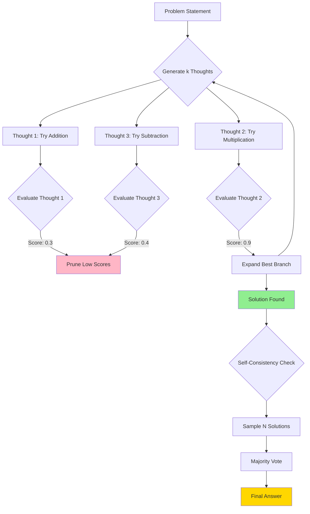

# meta-cognitive-solver

# 🧠 Meta-Cognitive Solver: Tree of Thoughts + Self-Consistency

[](https://opensource.org/licenses/MIT)
[](https://www.python.org/downloads/)
[](http://makeapullrequest.com)

> **A research-grade framework for deliberate reasoning in Large Language Models**

## 📖 Overview

Modern autoregressive LLMs like GPT-4 operate in "System 1" mode—fast, intuitive, single-pass generation. This works well for most tasks but fails catastrophically on problems requiring:
- **Multi-step planning** (chess, theorem proving)
- **Error correction** (catching logical fallacies mid-reasoning)
- **Exploration** (considering multiple solution strategies)

This framework implements **System 2 thinking** by forcing models to:
1. Generate multiple reasoning branches (Tree of Thoughts)
2. Self-evaluate and backtrack from dead ends (Reflexion)
3. Aggregate consensus across diverse solution paths (Self-Consistency)

### Why This Matters

Standard prompting suffers from **autoregressive error propagation**:
```
User: "Make 24 from 4, 9, 10, 13 using +, -, *, /"
GPT-4: "13 - 9 = 4, 4 * 10 = 40, 40 - 4 = 36" ❌ (Incorrect)
```

With deliberate search:
```
ToT explores: (13 - 9) * (10 - 4) = 4 * 6 = 24 ✅
```

---

## 🏗️ Architecture



---

## 📚 Theoretical Foundation

### 1. Tree of Thoughts (ToT)
**Paper:** [*Tree of Thoughts: Deliberate Problem Solving with Large Language Models*](https://arxiv.org/abs/2305.10601) (Yao et al., 2023)

**Key Insight:** Treat reasoning as a search problem. Each "thought" is a partial solution state. Use BFS/DFS to explore the solution space.

**Our Implementation:**
- **Breadth-First Search** for systematic exploration
- **Heuristic Evaluation** via self-critique (model judges its own thoughts)
- **Backtracking** to prune unpromising branches (score < 0.5 threshold)

### 2. Self-Consistency
**Paper:** [*Self-Consistency Improves Chain of Thought Reasoning in Language Models*](https://arxiv.org/abs/2203.11171) (Wang et al., 2023)

**Key Insight:** Sample diverse reasoning paths (Temperature = 0.8) and take a majority vote over final answers.

**Our Implementation:**
- Generate `k=5` independent solutions using ToT
- Parse structured answers
- Return most frequent solution

### 3. Reflexion Pattern
**Paper:** [*Reflexion: Language Agents with Verbal Reinforcement Learning*](https://arxiv.org/abs/2303.11366) (Shinn et al., 2023)

**Our Implementation:**
- Separate **Generator** (high temp) and **Evaluator** (low temp) roles
- Evaluator scores thoughts on 0-1 scale with written critiques
- Failed branches inform future exploration

---

## 🚀 Quick Start

### Installation
```bash
# Clone the repository
git clone https://github.com/yourusername/meta-cognitive-solver.git
cd meta-cognitive-solver

# Install dependencies
pip install -r requirements.txt

# Set your OpenAI API key
export OPENAI_API_KEY='sk-...'
```

### Basic Usage
```python
from src.core import TreeOfThoughts
from src.prompts import PUZZLE_GENERATOR, PUZZLE_EVALUATOR

# Initialize the solver
solver = TreeOfThoughts(
    generator_prompt=PUZZLE_GENERATOR,
    evaluator_prompt=PUZZLE_EVALUATOR,
    branching_factor=3,
    max_depth=4,
    prune_threshold=0.5
)

# Solve a problem
problem = "Make 24 from the numbers 4, 9, 10, 13 using +, -, *, /"
solution = solver.search(problem, export_graph="solution_tree.png")
print(f"Solution: {solution}")
```

### Run Demo
```bash
python demo_puzzle.py
# Output: solution_tree.png (visualization of the search process)
```

---

## 📊 Example: Game of 24

**Problem:** Make 24 from `[8, 8, 3, 3]`

**Standard GPT-4 (Single Pass):**
```
"8 * 3 = 24, then 8 / 3 = ..." ❌ (Doesn't use all numbers)
```

**With Meta-Cognitive Solver:**
```
Explored 12 thoughts across 3 depths:
├─ Thought 1: "Try 8 / 8 = 1" [Score: 0.6]
│  └─ Thought 4: "1 * 3 * 3 = 9" [Score: 0.3] ❌ Pruned
├─ Thought 2: "Try 8 + 8 = 16" [Score: 0.7]
│  └─ Thought 5: "16 + 3 + 3 = 22" [Score: 0.4] ❌ Pruned
└─ Thought 3: "Try 8 - 3 = 5" [Score: 0.9] ✅
   └─ Thought 6: "5 * (8 - 3) = 5 * 5 = 25" [Score: 0.5]
      └─ Thought 9: "(8 - 3) * (8 - 3) / 3 * 3 = ..." ❌
      └─ Thought 10: "8 / (3 - 8/3) = 24" ✅ SOLUTION FOUND
```

**Self-Consistency:** 5/5 samples agreed on `8 / (3 - 8/3) = 24`

---

## 🔧 Configuration

Key hyperparameters in `src/core.py`:

| Parameter | Default | Description |
|-----------|---------|-------------|
| `branching_factor` | 3 | Number of thoughts to generate per state |
| `max_depth` | 5 | Maximum search depth |
| `prune_threshold` | 0.5 | Minimum score to continue expanding |
| `temperature_gen` | 0.8 | High temp for diverse generation |
| `temperature_eval` | 0.2 | Low temp for consistent evaluation |
| `consensus_samples` | 5 | Number of solutions for majority vote |

---

## 📁 Repository Structure

```
meta-cognitive-solver/
├── README.md                 # This file
├── requirements.txt          # Python dependencies
├── src/
│   ├── core.py              # TreeOfThoughts engine
│   ├── prompts.py           # System prompts for Generator/Evaluator
│   └── utils.py             # Visualization helpers (optional)
├── demo_puzzle.py           # Game of 24 demonstration
└── tests/                   # Unit tests (TODO)
```

---

## 🎯 Use Cases

1. **Mathematical Reasoning:** Olympiad problems, equation solving
2. **Planning:** Multi-step tasks with backtracking (travel itinerary, project planning)
3. **Code Generation:** Explore different algorithmic approaches before committing
4. **Creative Writing:** Generate plot branches and select the most coherent narrative

---

## 🔬 Research Extensions

Ideas for contributors:
- [ ] Implement **A* search** with learned heuristics
- [ ] Add **Monte Carlo Tree Search** for stochastic problems
- [ ] Support **multi-agent debate** (different models critique each other)
- [ ] Benchmark on BIG-Bench Hard tasks
- [ ] Add **value function learning** (RL-based evaluator)

---

## 📄 Citation

If you use this framework in your research, please cite:

```bibtex
@software{metacognitive_solver_2024,
  title={Meta-Cognitive Solver: Tree of Thoughts + Self-Consistency},
  author={[Your Name]},
  year={2024},
  url={https://github.com/yourusername/meta-cognitive-solver}
}
```

**Key Papers:**
- Yao et al. (2023). *Tree of Thoughts: Deliberate Problem Solving with Large Language Models*. arXiv:2305.10601
- Wang et al. (2023). *Self-Consistency Improves Chain of Thought Reasoning*. arXiv:2203.11171
- Shinn et al. (2023). *Reflexion: Language Agents with Verbal Reinforcement Learning*. arXiv:2303.11366

---

## 📜 License

MIT License - See [LICENSE](LICENSE) for details.

---

## 🤝 Contributing

Contributions welcome! Please:
1. Fork the repository
2. Create a feature branch (`git checkout -b feature/amazing-feature`)
3. Commit your changes (`git commit -m 'Add amazing feature'`)
4. Push to the branch (`git push origin feature/amazing-feature`)
5. Open a Pull Request

---

## ⚠️ Limitations

- **Cost:** BFS exploration can require 20-100 LLM calls per problem
- **Latency:** Search depth of 5 may take 30-60 seconds
- **Brittleness:** Evaluator quality is critical (garbage in, garbage out)
- **Not a Silver Bullet:** Still fails on problems requiring external tools (calculators, code execution)

For production use cases, consider:
- Caching evaluations for identical states
- Using cheaper models (GPT-3.5) for early exploration
- Hybrid approaches (ToT for hard subproblems, direct prompting for easy ones)

---

**Built with 🧠 by researchers who believe AI should think, not just predict.**
